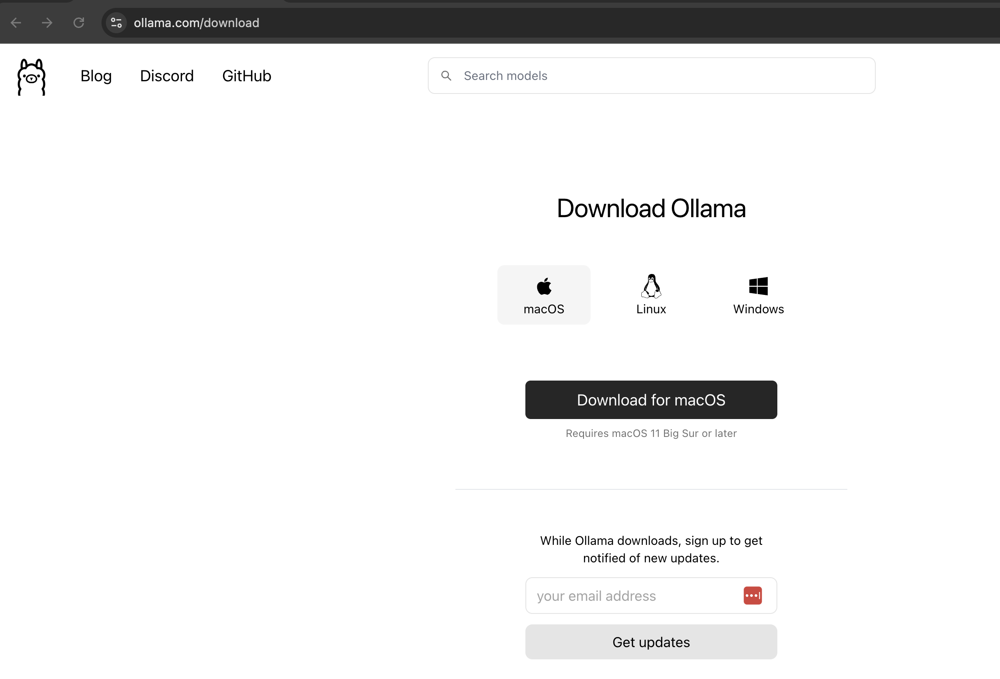
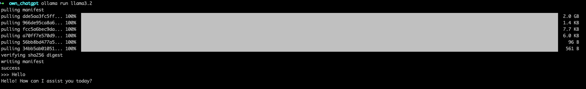

# Ollama Installation Guide for macOS

Follow this guide to download and install Ollama on your macOS device quickly and efficiently.

---

## **Prerequisites**

Ensure your macOS device meets the following requirements:

- **macOS Version**: 11.0 (Big Sur) or later
- **Storage**: At least 4GB of free disk space
- **Internet Connection**: Required for download and updates

---

## **Installation Steps**

### **Step 1: Download Ollama**
1. Navigate to the official Ollama website: [https://ollama.ai/download](https://ollama.ai/download).

2. Click the **Download for macOS** button to initiate the download.

### **Step 2: Open the Installer**
1. Locate the downloaded `Ollama-darwin.zip` file in your **Downloads** folder.
2. Double-click the file to open the installation package.

### **Step 3: Install Ollama**
1. Drag the Ollama app icon into the **Applications** folder as instructed.
2. After the installation, eject the installer by dragging it to the **Trash**.

### **Step 4: Launch Ollama**
1. Open the **Applications** folder on your macOS.
2. Find and double-click the **Ollama** app icon to launch it.
3. Follow the on-screen prompts to complete the setup or log in to your account.

---

## **Optional: Add Ollama to Your Dock**

To easily access Ollama:
1. Right-click the Ollama icon in the dock when it’s running.
2. Choose **Options > Keep in Dock**.

---

## **Troubleshooting**

- **App Blocked by macOS**:  
  If you see a security warning, go to **System Preferences > Security & Privacy > General** and click **Open Anyway**.
  
